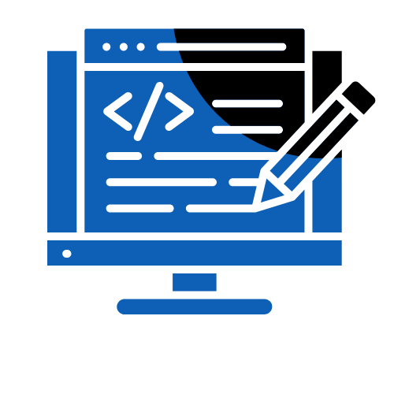
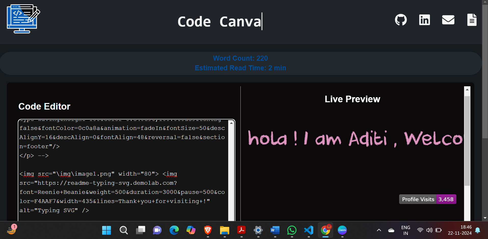

# Code Canvas

**Code Canvas** is a lightweight and user-friendly code editor designed specifically for writing and previewing Markdown. It is an ideal tool for developers, writers, and anyone looking to create rich text documents in Markdown with ease.

 <b>Click this icon to view Project<b>

---

